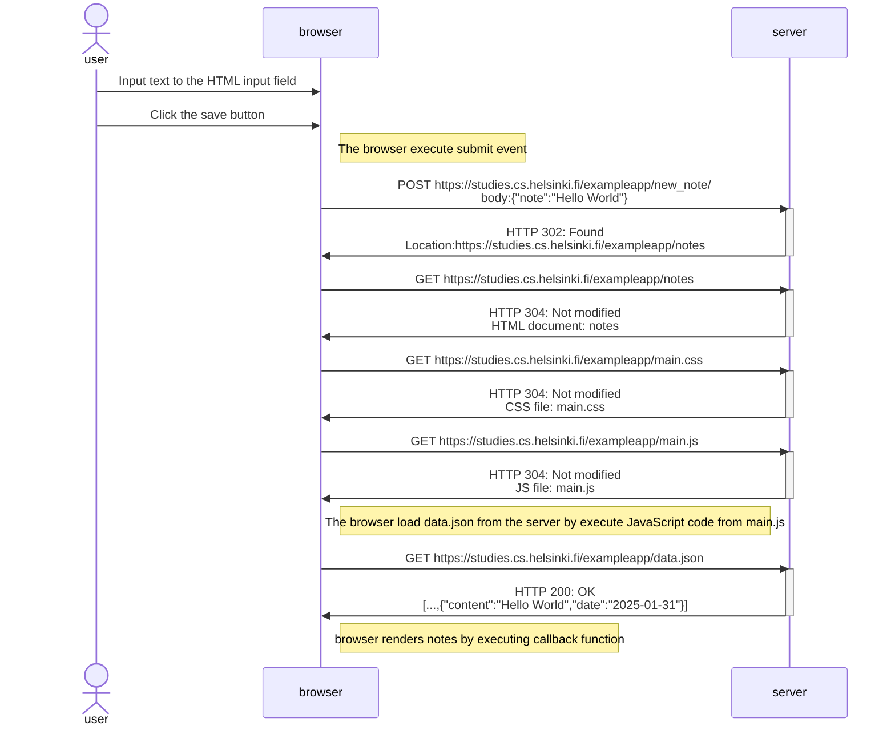
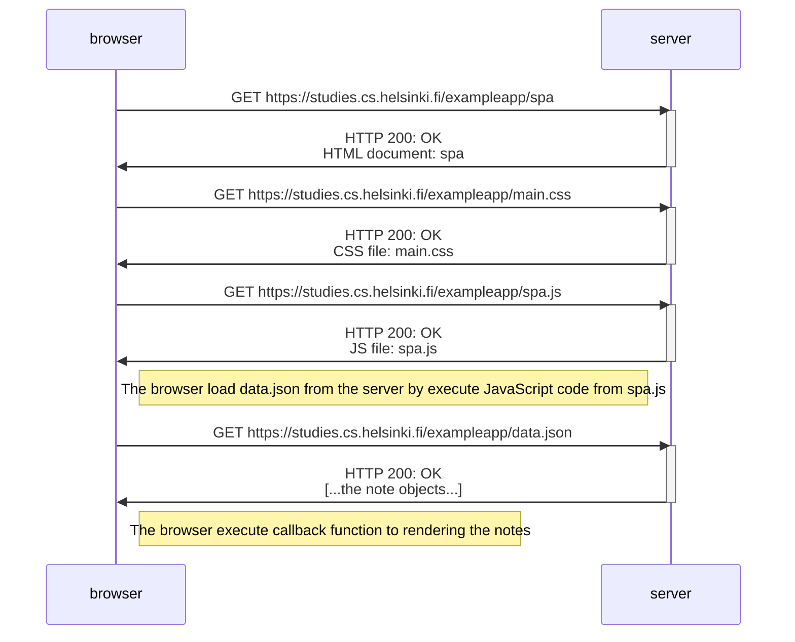
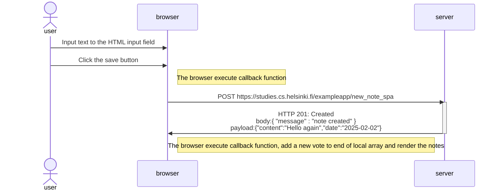

# Part 0

## Exercise 0.4: New note

```mermaid
sequenceDiagram
  actor user
  participant browser
  participant server

  user->>browser: Input text to the HTML input field
  
  user->>browser: Click the save button
  Note right of browser: The browser execute submit event

  browser->>server: POST https://studies.cs.helsinki.fi/exampleapp/new_note/ <br> body:{"note":"Hello World"}
  activate server
  server->>browser: HTTP 302: Found <br> Location:https://studies.cs.helsinki.fi/exampleapp/notes
  deactivate server

  browser->>server: GET https://studies.cs.helsinki.fi/exampleapp/notes
  activate server
  server->>browser: HTTP 304: Not modified <br> HTML document: notes
  deactivate server

  browser->>server: GET https://studies.cs.helsinki.fi/exampleapp/main.css
  activate server
  server->>browser: HTTP 304: Not modified <br> CSS file: main.css
  deactivate server

  browser->>server: GET https://studies.cs.helsinki.fi/exampleapp/main.js
  activate server
  server->>browser: HTTP 304: Not modified <br> JS file: main.js
  deactivate server

  Note right of browser: The browser load data.json from the server by execute JavaScript code from main.js

  browser->>server: GET https://studies.cs.helsinki.fi/exampleapp/data.json
  activate server
  server->>browser: HTTP 200: OK <br> [...,{"content":"Hello World","date":"2025-01-31"}]
  deactivate server

  Note right of browser: browser renders notes by executing callback function

```

## Exercise 0.5: Single Page App

```mermaid
sequenceDiagram
  participant browser
  participant server

  browser->>server: GET https://studies.cs.helsinki.fi/exampleapp/spa
  activate server
  server->>browser: HTTP 200: OK <br> HTML document: spa
  deactivate server

  browser->>server: GET https://studies.cs.helsinki.fi/exampleapp/main.css
  activate server
  server->>browser: HTTP 200: OK <br> CSS file: main.css
  deactivate server

  browser->>server: GET https://studies.cs.helsinki.fi/exampleapp/spa.js
  activate server
  server->>browser: HTTP 200: OK <br> JS file: spa.js
  deactivate server

  Note right of browser: The browser load data.json from the server by execute JavaScript code from spa.js

  browser->>server: GET https://studies.cs.helsinki.fi/exampleapp/data.json
  activate server
  server->>browser: HTTP 200: OK <br> [...the note objects...]
  deactivate server

  Note right of browser: The browser execute callback function to rendering the notes

```

## Exercise 0.6: SPA New note

```mermaid
sequenceDiagram
  actor user
  participant browser
  participant server

  user->>browser: Input text to the HTML input field
  
  user->>browser: Click the save button
  Note right of browser: The browser execute callback function

  browser->>server: POST https://studies.cs.helsinki.fi/exampleapp/new_note_spa
  activate server
  server->>browser: HTTP 201: Created <br> body:{ "message" : "note created" } <br> payload:{"content":"Hello again","date":"2025-02-02"}
  deactivate server

  Note right of browser: The browser execute callback function, add a new vote to end of local array and render the notes

```
